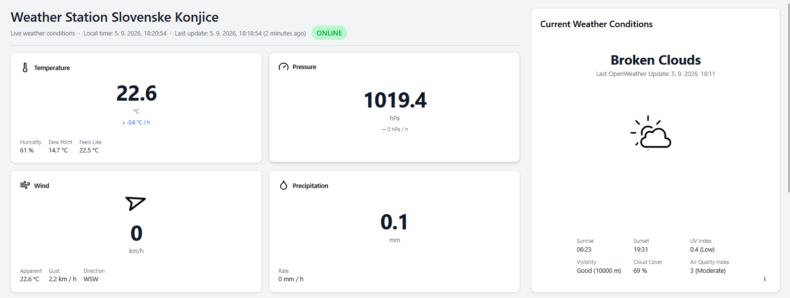
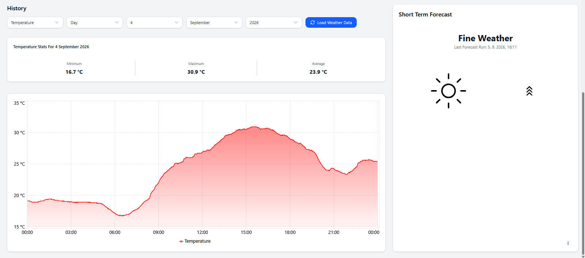
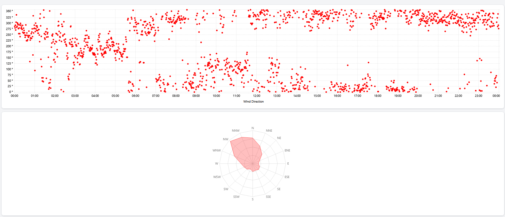

# PWS Web App

A full-stack web application built for my personal weather station. It provides a fast and minimalistic view of live weather data and historical observations using interactive charts. It also features a short-term weather forecast based on a modified Zambretti algorithm.

**Live Demo:** https://weather-station-konjice.onrender.com/

## Features

### Live Data Dashboard & Short-Term Forecast

The dashboard provides a quick overview of the latest data reported by the weather station, including temperature, humidity, pressure, wind speed and wind direction. It also displays the station's local time, the time of the latest update, and a status indicator.

The dashboard also includes current conditions card. It includes general weather conditions description and icon. Some additional parameters such as visibility, cloud cover, air quality index and more are also displayed. Information on this card is collected from [OpenWeather](https://openweathermap.org/).



### Statistics & Charts

Historical weather data can be browsed using selectable time periods: **All Time**, **Year**, **Month**, and **Day**.

For selected day and month periods, the application provides interactive charts for individual weather parameters.

The statistics card displays the **minimum**, **maximum**, and **average** values for the selected parameter and time period.

Wind direction has a dedicated visualization that represents directions as degrees on a circular chart. Since this can be difficult to interpret at a glance, a wind rose is also provided to show the dominant wind directions more clearly.





### Short Term Forecast

A short-term weather forecast is generated using a modified Zambretti algorithm. The forecast displays a short text description along with weather icons for easier interpretation.

An arrow indicates the expected trend of the weather: pointing down when conditions are expected to worsen (e.g. rain is approaching) and pointing up when conditions are expected to improve or stabilize.

## Tech Stack

- Typescript
- Node.js
- Express
- React
- Drizzle ORM
- PostgreSQL

## How to Run Locally

Install the project dependencies by running `npm install` in the project root and in each package/application directory:

- `packages/db`
- `packages/shared`
- `apps/api`
- `apps/web`

Create `.env` files in `apps/api` and `apps/web`. Example environment files are provided with all required parameters that need to be configured before running the application.

Navigate to `packages/db` and generate and migrate the database schema:

```bash
npm run generate
npm run migrate
```

Start the backend and frontend from the project root:

```bash
npm run dev
```

The backend will be available at:

http://localhost:3001/

The frontend will be available at:

http://localhost:5173/

API documentation is available at:

http://localhost:3001/api/v1/docs

OR

https://weather-station-slov-konjice.onrender.com/api/v1/docs/

## Zambretti Algorithm

The application uses a modified version of the Zambretti weather forecasting algorithm.

The original algorithm uses atmospheric pressure trends to select one of 26 possible forecast outcomes. My implementation is based on [this description of the Zambretti algorithm](https://communities.sas.com/t5/Streaming-Analytics/Zambretti-Algorithm-for-Weather-Forecasting/td-p/679487), with custom thresholds and additional scoring based on wind direction, wind speed, and season.

The algorithm runs once per hour and uses the following inputs:

- Current mean sea level (MSL) pressure
- MSL pressure from three hours earlier
- Current wind direction
- Current wind speed
- Current season

### Custom Modifications

The pressure trend is classified using the change in MSL pressure over the previous three hours:

- **Rising:** pressure change is greater than or equal to 2 hPa
- **Falling:** pressure change is less than or equal to -2.25 hPa
- **Steady:** values between these thresholds

Additional adjustments are then applied to the forecast score:

- Rising pressure during summer subtracts 1 from the final score, as rising pressure during summer generally indicates more stable weather.
- Falling pressure during winter adds 1 to the final score, as falling pressure during winter can indicate approaching precipitation.
- Wind directions between **180° and 314°** receive a score of 1.5, as southern and western winds can occur ahead of approaching fronts.
- Wind directions between **315° and 45°** receive a score of 0 and therefore have no effect on the forecast.
- Other wind directions receive a score of 0.25.

The wind-direction score is further adjusted according to wind speed:

- Below 5 km/h: score × 0.2
- 5–15 km/h: score × 0.5
- Above 15 km/h: no reduction

These modifications were designed specifically for this application and are not part of the original Zambretti algorithm.

## Weather Station

The application uses data collected from my personal Ecowitt weather station.

### Temperature & Humidity Sensor

**Ecowitt WH32 temperature and humidity sensor**

The sensor is installed approximately 1.7 m above ground over grass in a shaded location. A DIY radiation shield protects the sensor from direct solar radiation and helps improve measurement accuracy.

### Rainfall Sensor

**Ecowitt WH40H rain gauge**

The rain gauge is a traditional tipping-bucket rain sensor installed slightly above ground and away from buildings and trees that could otherwise affect rainfall measurements.

### Wind Sensor

**Ecowitt WS85 ultrasonic anemometer**

The ultrasonic anemometer is installed at the highest practical location available to improve wind measurement accuracy.
